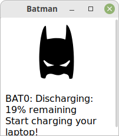

# batman

*Keep your laptop battery healthy with batman!*

## About

`batman` is a command-line application for monitoring your battery charging status.

## Usage

Use the command `batman start min max` to start a monitoring daemon process. (You can make the command part of the startup applications of your OS for convenience)

When your laptop battery is discharging and reaches `min`, `batman` will show a popup to warn you to plug in the battery charger. When your laptop is charging and reaches `max`, `batman` will warn you to stop charging.

You can also check manually on the command-line with `batman check --raw`

Use the command `batman stop` to stop the program.

## Battery life

In this way, `batman` helps you save battery [charging cycles](https://www.digitaltrends.com/computing/how-to-care-for-your-laptops-battery/), thus prolonging battery life.

Sensible values for `min` and `max` are, for instance, `20` and `90`.

## Installation

Build batman from source with `go build`, e.g.: `go build -o batman main.go`, defining your OS and architecture in environment variables `GOOS` and `GOARCH`.

For more details and inspiration, see the Bash script `build` in this repo.
